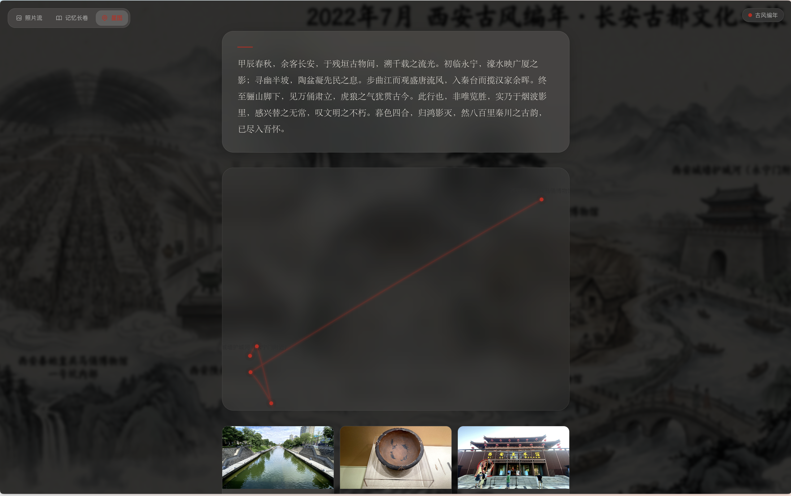
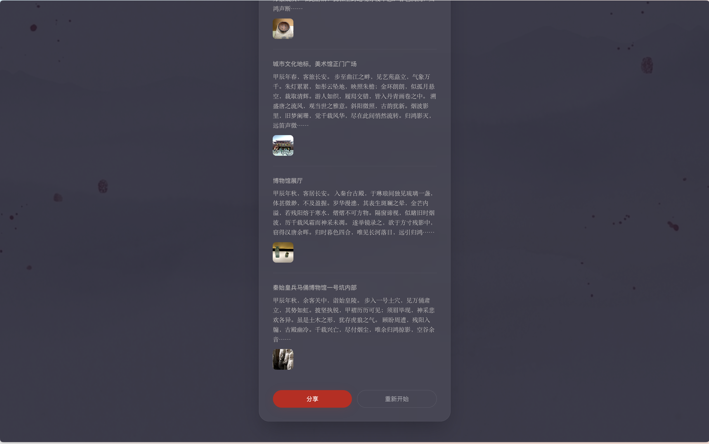

# 追忆 Zhuīyì 📜 

<div align="center">
  <h3>AI 驱动的照片编年史生成器</h3>
  <p>上传照片，让 AI 唤醒你的记忆。</p>

  <p>
    
    
    
    
    
  </p>

  <p>
    <a href="#-功能">功能</a> •
    <a href="#-界面">界面</a> •
    <a href="#-技术架构">技术架构</a> •
    <a href="#-快速开始">快速开始</a>
  </p>

  <p>
    <strong>简体中文</strong> |
    <a href="./README_EN.md">English</a>
  </p>
</div>

---

**追忆** 是一个 AI 驱动的照片叙事应用。它将你上传的照片自动聚类、分析、生成文学叙事，并以沉浸式的交互体验呈现——从照片流到记忆长卷，从星图到分享，让每一段旅程都成为值得回味的编年史。

## ✨ 功能

- 📸 **智能照片分析** — 自动提取 EXIF（GPS、时间）并用 AI 识别场景、情绪、地点
- 📖 **多风格叙事** — 古风、散文、日记、武侠、赛博朋克等多种文学风格，各具韵味
- 🖼️ **三种浏览模式** — 照片流（全屏滑动）、记忆长卷（时间轴叙事）、星图（轨迹可视化）
- 🎨 **AI 场景生成** — 根据旅程生成独一无二的记忆长卷封面
- 💾 **本地历史** — 所有记录持久化到 localStorage，随时回看
- 🔄 **路由恢复** — 基于 hash 的状态管理，刷新不丢数据

## 📸 界面

| | |
| :---: | :---: |
|  <br> 首页 |  <br> 唤醒记忆 |
|  <br> 照片流 |  <br> 记忆长卷 |
|  <br> 星图 |  <br> 分享 |

## 🏗️ 技术架构

| 层级 | 技术 |
| :--- | :--- |
| 框架 | Next.js 14 (App Router) |
| AI | Gemini 3 Flash (分析 + 叙事), Gemini 3.1 Flash (图像生成) |
| 状态 | Zustand + localStorage 持久化 |
| 动画 | Framer Motion |
| 样式 | Tailwind CSS + CSS-in-JS 主题 |
| 路由 | Hash-based SPA 路由 |

## 🚀 快速开始

```bash
# 克隆项目
git clone https://github.com/your-username/zhuiyi.git
cd zhuiyi

# 安装依赖
corepack enable
pnpm install --frozen-lockfile

# 配置环境变量
cp .env.local.example .env.local
# 编辑 .env.local 填入你的 API key

# 启动开发服务器
pnpm dev
```

### 环境变量

| 变量 | 说明 |
| :--- | :--- |
| `GOOGLE_AI_API_KEY` | Google AI 主通道；生产环境必需 |
| `OLLAMA_API_KEY` | 可选的文本与视觉理解兜底通道 |
| `OLLAMA_BASE_URL` | 可选的 Ollama OpenAI-compatible 地址 |
| `NEXT_PUBLIC_SUPABASE_URL` | 可选；启用云端登录与历史同步 |
| `NEXT_PUBLIC_SUPABASE_ANON_KEY` | 可选；启用云端登录与历史同步 |
| `LOG_LEVEL` | 可选；`debug`、`info`、`warn` 或 `error` |

未配置 Supabase 时，应用仍以 localStorage 保存本地历史；云端账号与跨设备同步不会显示。

## 📄 许可

MIT License
