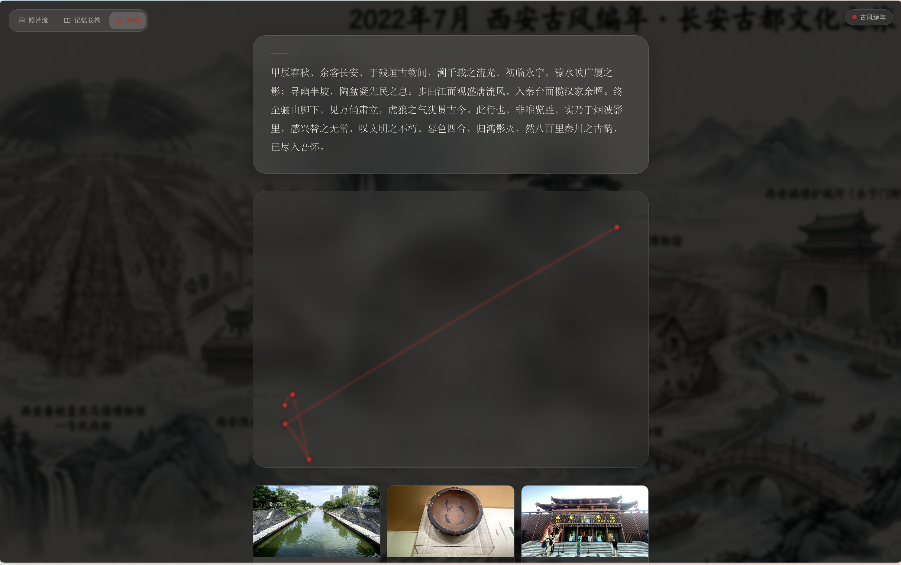
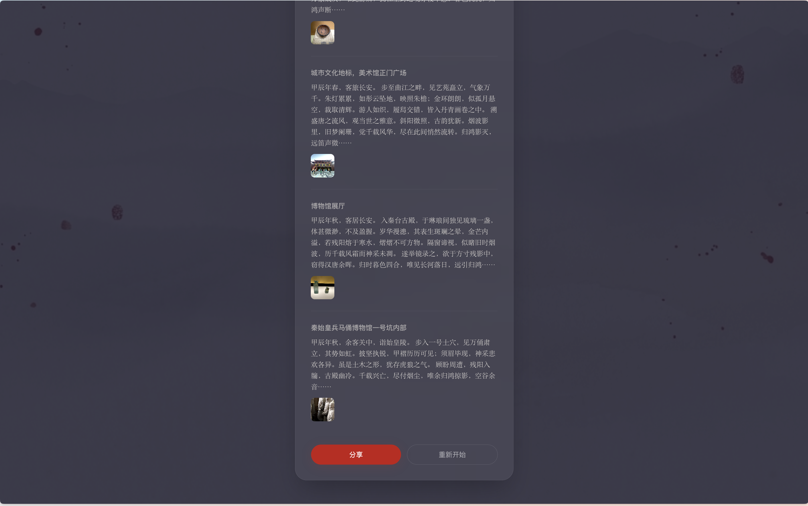

# 追忆 Zhuīyì 📜

<div align="center">
  <h3>AI-Powered Photo Chronicle Generator</h3>
  <p>Upload your photos, let AI awaken your memories.</p>

  <p>
    
    
    
    
    
  </p>

  <p>
    <a href="#-features">Features</a> •
    <a href="#-screenshots">Screenshots</a> •
    <a href="#-tech-stack">Tech Stack</a> •
    <a href="#-quick-start">Quick Start</a>
  </p>

  <p>
    <a href="./README.md">简体中文</a> |
    <strong>English</strong>
  </p>
</div>

---

**Zhuīyì** is an AI-driven photo narrative app. It automatically clusters, analyzes, and generates literary narratives from your uploaded photos—presented through an immersive experience ranging from photo flow to memory scrolls, star maps, and sharing. Every journey becomes a chronicle worth revisiting.

## ✨ Features

- 📸 **Smart Photo Analysis** — Extracts EXIF (GPS, timestamps) and uses AI to identify scenes, moods, and locations
- 📖 **Multi-Style Narratives** — Three literary styles: Ancient Chronicle, Proustian Remembrance, and Cyberpunk
- 🖼️ **Three View Modes** — Photo Flow (full-screen swipe), Memory Scroll (timeline narrative), Star Map (trajectory visualization)
- 🎨 **AI Scene Generation** — Generates a unique panoramic cover image for your journey
- 💾 **Local History** — All records persisted to localStorage, revisit anytime
- 🔄 **Route Recovery** — Hash-based state management, survives page refreshes

## 📸 Screenshots

| | |
| :---: | :---: |
|  <br> Landing |  <br> Processing |
|  <br> Photo Flow |  <br> Memory Scroll |
|  <br> Star Map |  <br> Share |

## 🏗️ Tech Stack

| Layer | Technology |
| :--- | :--- |
| Framework | Next.js 14 (App Router) |
| AI | Gemini 3 Flash (analysis + narration), Gemini 3.1 Flash (image generation) |
| State | Zustand + localStorage persistence |
| Animation | Framer Motion |
| Styling | Tailwind CSS + CSS-in-JS theming |
| Routing | Hash-based SPA routing |

## 🚀 Quick Start

```bash
# Clone the project
git clone https://github.com/your-username/zhuiyi.git
cd zhuiyi

# Install dependencies
npm install

# Configure environment variables
cp .env.local.example .env.local
# Edit .env.local with your API key

# Start dev server
npm run dev
```

### Environment Variables

| Variable | Description |
| :--- | :--- |
| `GEMINI_API_KEY` | Google AI Studio API Key |

## 📄 License

MIT License